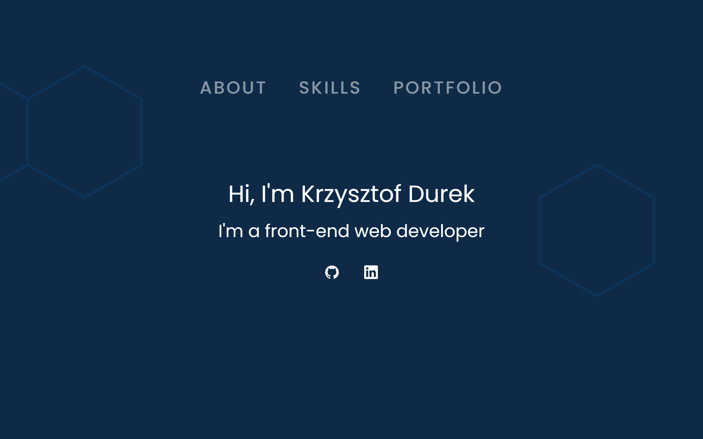

<p align="center">
  <a href="https://github.com/durashere/portfolio-v1">
    
  </a>
  <h3 align="center">Portfolio</h3>

  <p align="center">
    My first
    <br />
    <br />
    <a href="https://krzysztofdurek.vercel.app">View Demo</a>
    ·
    <a href="https://github.com/durashere/portfolio-v1/issues">Report Bug</a>
    ·
    <a href="https://github.com/durashere/portfolio-v1/issues">Request Feature</a>
  </p>
</p>

### Built With

* [Next.js](https://nextjs.org)
* [Tailwind CSS](https://tailwindcss.com)

## Getting Started

To get a local copy up and running follow these simple example steps.

### Prerequisites

* npm or yarn
  ```sh
  npm install npm@latest -g
  # or
  npm install yarn -g
  ```

### Installation

1. Clone the repo
   ```sh
   git clone https://github.com/durashere/portfolio-v1
   ```
2. Install packages
   ```sh
   npm install
   # or
   yarn
   ```
3. Run the development server
   ```sh
   npm run dev
   # or
   yarn dev
   ```
